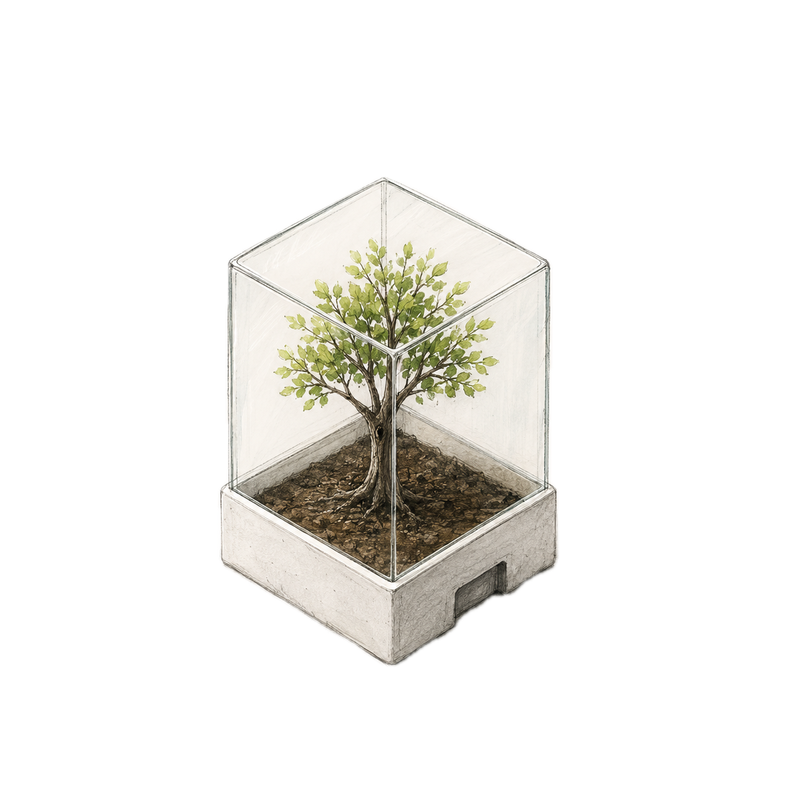
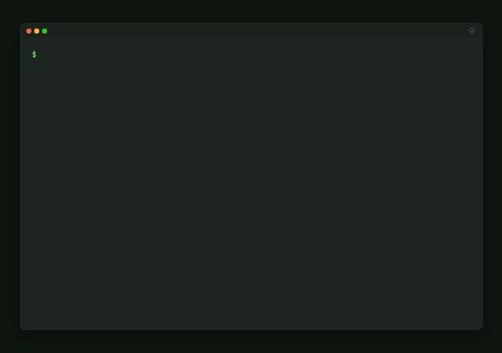

---
hide:
  - navigation
  - toc
---

<div class="tx-hero" markdown>
<div class="tx-hero__content" markdown>

# Isolated, ready-to-run git worktrees for coding agents

One directory per worktree name — cut fresh from `origin`, dependencies warm
from a shared cache, your agent launched inside. Host-native, or sealed in a
Docker sandbox.

<div class="tx-hero__buttons" markdown>

[Install](install.md){ .md-button .md-button--primary }
[See the full cycle](usage.md){ .md-button }

</div>
</div>
<div class="tx-hero__image">
  
</div>
</div>

<div class="tx-demo">
  
</div>

Name the branch up front (`treebox create fix-auth`) or don't: an unnamed
worktree gets its own directory and a `treebox/<petname>` placeholder branch
that can't be pushed — the agent renames it when the work takes shape. Agents
work the same repo in parallel without collisions — on a laptop or over
plain SSH.

## Why treebox

<div class="grid cards" markdown>

- :material-source-branch:{ .lg .middle } **One directory per worktree**

    ---

    `git worktree` under the hood — parallel agents, no shared files,
    indexes, or dev servers. Branches are named later, when the work
    has taken shape.

- :material-refresh:{ .lg .middle } **Never silently stale**

    ---

    `create` branches from a fresh `origin/<base>` after a required fetch;
    a failed fetch exits loudly instead of building on old refs.

- :material-lightning-bolt:{ .lg .middle } **Warm in seconds**

    ---

    Installs hardlink from shared caches (`~/.cache/uv`, the pnpm store, …).
    `enter` re-syncs only when the lockfile changed (an interrupted setup
    is finished rather than skipped).

- :material-cube-outline:{ .lg .middle } **The sandbox config lives outside the box**

    ---

    The container is rendered from *your* operator template, never
    mounted — a boxed agent can't edit its own cage.

</div>

## Two isolation modes, one pipeline

Provisioning is identical either way; a pluggable **isolation mode** decides
where the agent runs:

| `--isolation`    | Sandbox   | Agent runs in                                         |
| ---------------- | --------- | ----------------------------------------------------- |
| `host` (default) | none      | the worktree shell                                    |
| `docker`         | sandboxed | a docker container, with your `.env` + caches mounted |

```bash
treebox create fix-auth                    # branch fix-auth off fresh origin/main
treebox create fix-auth --isolation docker   # same provisioning, sandboxed
```

Docker isolation needs exactly one extra thing: Docker — see
[what each isolation mode needs](install.md#what-each-isolation-mode-needs).

## What it is — and isn't

<div class="grid tx-checklist" markdown>

<div markdown>

**treebox does**

- :material-check:{ .tx-yes } Provision isolated worktrees, one per worktree name
- :material-check:{ .tx-yes } Branch from a fresh `origin/<base>` — never stale refs
- :material-check:{ .tx-yes } Install deps from shared caches (uv, npm, pnpm, go, cargo)
- :material-check:{ .tx-yes } Copy your `.env` and submodules into place
- :material-check:{ .tx-yes } Launch `claude` / `codex` with your subscription login
- :material-check:{ .tx-yes } Speak script: stable exit codes, `--json`, `--dry-run`

</div>
<div markdown>

**treebox doesn't**

- :material-close:{ .tx-no } Manage API keys — agents launch with your subscription login
- :material-close:{ .tx-no } Review, merge, or push your branches
- :material-close:{ .tx-no } Trust the target repo's config — its container config and hooks are ignored
- :material-close:{ .tx-no } Isolate anything in `host` isolation — that's what `docker` is for
- :material-close:{ .tx-no } Replace CI, or orchestrate fleets of agents
- :material-close:{ .tx-no } Install a package manager behind your back

</div>
</div>

## Sixty seconds, end to end

```bash
treebox doctor                       # verify the host is ready
treebox create                       # provision + launch claude (name generated)
treebox enter brave-otter --harness codex   # re-enter later; -H overrides the recorded harness for this session
treebox list                         # what exists, what's stale
treebox teardown brave-otter --delete-branch
```

Five commands cover the core lifecycle — with `template` for docker sandbox
templates and `version` alongside. [Install it](install.md), or read
[how it works](how-it-works.md).

---

Built by **[Seth Peters](https://www.linkedin.com/in/seth-peters/)** — an
operator-focused layer for coding-agent infrastructure: git worktrees, sandbox
boundaries, subscription auth, and repeatable dev environments. Building in
this space? [Connect on LinkedIn](https://www.linkedin.com/in/seth-peters/).
